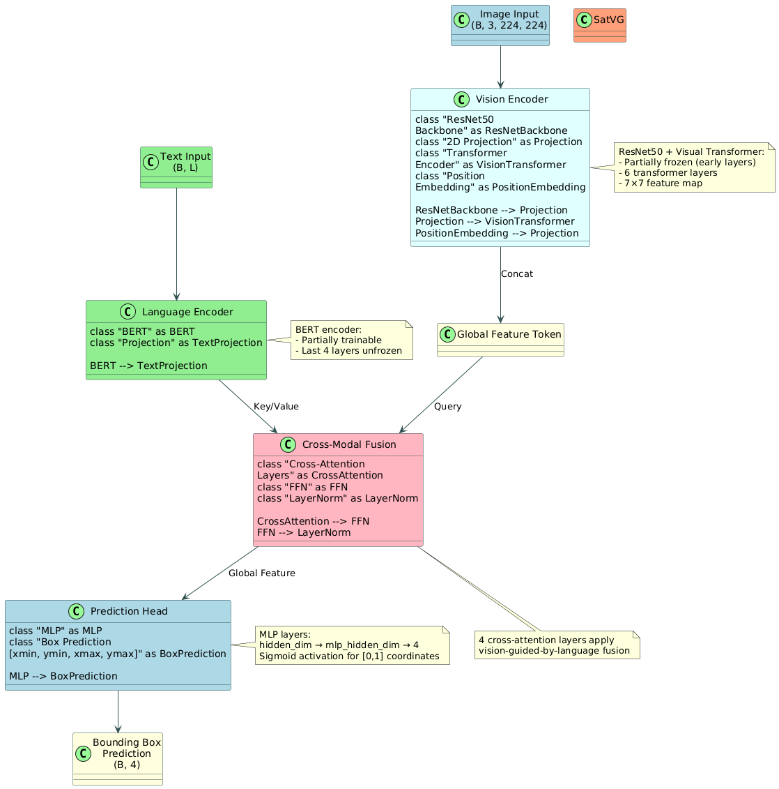

# SatVG: Visual Grounding Model

This repository contains an implementation of the TransVG (Transformer for Visual Grounding) model, a cross-modal architecture for grounding natural language expressions in images.

## Overview

Visual grounding is the task of localizing an image region described by a natural language expression. Our implementation uses a transformer-based architecture that performs cross-modal fusion between visual and linguistic features to predict bounding box coordinates.

## Model Architecture



The TransVG architecture consists of the following components:

1. **Vision Encoder**: A ResNet50 backbone followed by a transformer encoder to extract visual features
   - ResNet50 pretrained on ImageNet
   - Early layers frozen, later layers trainable
   - 2D projection from 2048 to hidden_dim (256)
   - Transformer with 6 layers and 8 attention heads
   - Position embeddings for spatial awareness

2. **Language Encoder**: A BERT-based encoder for text understanding
   - BERT-base-uncased with 12 layers
   - Last 4 layers unfrozen for fine-tuning
   - Projection to match hidden_dim if needed

3. **Cross-Modal Fusion**: Transformer-based cross-attention for multimodal integration
   - 4 cross-attention layers
   - Language features guide the visual feature processing
   - Global token aggregates contextual information

4. **Prediction Head**: MLP for bounding box coordinate regression
   - Outputs normalized [xmin, ymin, xmax, ymax] coordinates in [0,1] range
   - Ensures valid box constraints (xmax > xmin, ymax > ymin)

## Performance

Our baseline model achieves the following performance on the DIOR-RSVG dataset:

| Metric       | Value  |
|--------------|--------|
| Acc@0.25     | 0.3399 |
| Acc@0.5      | 0.1241 |
| Acc@0.75     | 0.0179 |
| mIoU         | 0.1947 |
| medianIoU    | 0.1049 |

## Setup and Installation

### Requirements

- Python 3.8+
- PyTorch 1.10+
- torchvision
- transformers (Hugging Face)
- numpy, PIL, etc.

### Installation

```bash
# Clone the repository
git clone https://github.com/yourusername/Trans-VG.git
cd Trans-VG

# Create a virtual environment
conda create -n transvg python=3.8
conda activate transvg

# Install dependencies
pip install -r requirements.txt
```

### Dataset

The model is trained on the DIOR-RSVG dataset, which should be structured as follows:

```
dior-rsvg/
├── JPEGImages/  # Image files
├── dior-train.pth  # Training annotations
├── dior-val.pth    # Validation annotations
└── dior-test.pth   # Test annotations
```

## Training

To train the model with our optimized settings:

```bash
./run_fixed_coordinates.sh
```

This script sets appropriate environment variables and runs the training with the following key parameters:
- Partially frozen vision backbone (ResNet50)
- 32 batch size
- Learning rate of 1e-3
- Optimizer: AdamW with weight decay 1e-4
- Gradient clipping at 1.0

## Evaluation

To evaluate a trained model:

```bash
python evaluate.py --checkpoint /path/to/checkpoint.pth --split test
```

## Visualization

To visualize predictions on sample images:

```bash
python visualize.py --checkpoint /path/to/checkpoint.pth --image /path/to/image.jpg --query "your text query"
```

## Citation

If you use this code, please cite the original TransVG paper:

```
@InProceedings{Deng_2021_ICCV,
    author    = {Deng, Jiajun and Yang, Zhengyuan and Chen, Tianlang and Zhou, Wengang and Li, Houqiang},
    title     = {TransVG: End-to-End Visual Grounding With Transformers},
    booktitle = {Proceedings of the IEEE/CVF International Conference on Computer Vision (ICCV)},
    month     = {October},
    year      = {2021},
    pages     = {1769-1779}
}
```

## License

[MIT License](LICENSE)